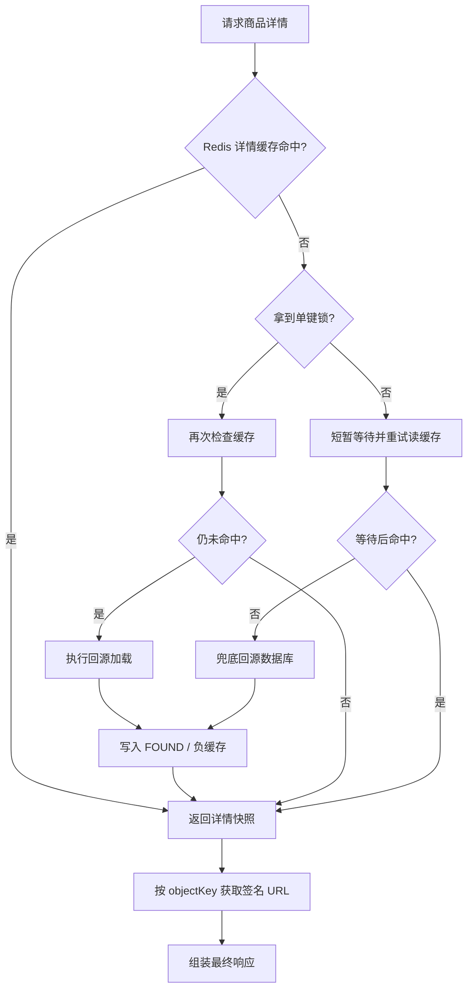
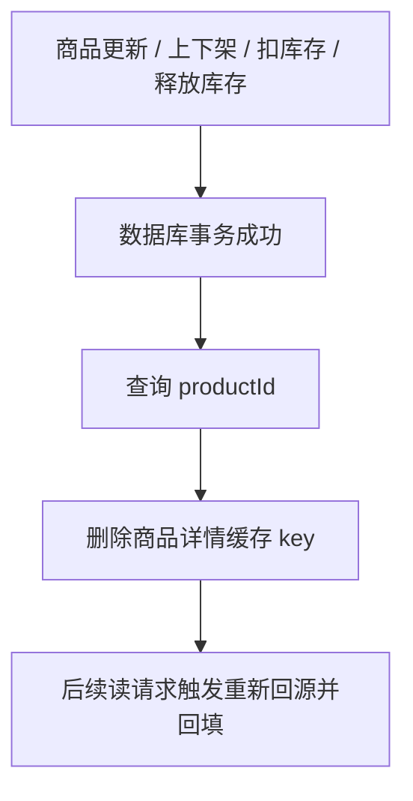

# 商品详情缓存改造原理讲解

## 1. 背景：为什么这里必须做缓存

`product-service` 的商品详情接口天然是热点读场景。热门商品会被反复访问，如果每次都直接查询 MySQL，读压力会集中落到数据库。

这条链路还同时存在 4 个典型风险：

1. 非法 `productId` 被反复请求，造成缓存穿透。
2. 热点商品缓存刚过期时，大量并发同时回源，造成缓存击穿。
3. 大量 key 在相近时间失效，造成缓存雪崩。
4. 商品详情和图片签名 URL 生命周期不同，如果混在一起缓存，容易返回临近过期甚至失效的链接。

这次改造的目标很明确：

1. 用 Redis 承接热点商品详情读流量。
2. 不让 Redis 接管库存正确性，库存真相源仍然是数据库。
3. 对“稳定数据”和“时效性派生数据”做分层缓存。
4. 让面试官追问到穿透、击穿、雪崩、一致性时都能落到具体代码。

---

## 2. 方案总览：这次到底缓存了什么

这次不是把最终 HTTP 响应整包塞进 Redis，而是拆成了两层缓存。

| 层次 | 缓存内容 | 目的 | 真实落点 |
| --- | --- | --- | --- |
| 第一层 | 商品详情原始快照：商品基本信息、SKU、价格区间、总库存、详情 HTML、图片 `objectKey` | 挡住 MySQL 热点读 | `ProductDetailCacheService` |
| 第二层 | 按 `objectKey` 缓存的图片签名 URL | 减少重复签名开销，同时避免长时间缓存失效 URL | `ProductCachedOssObjectService` |

核心边界只有一句话：

> Redis 是读优化层，不是真相源；库存正确性仍由数据库原子更新保证。

---

## 3. 读路径原理：请求是怎么走的



这个流程里有两个关键点：

1. 商品详情缓存存的是稳定快照，不直接存签名 URL。
2. 缓存未命中之后不是所有请求一起回源，而是只有一个请求优先回源，其他请求先等缓存被预热。

---

## 4. 核心设计拆解

### 4.1 商品详情缓存：缓存的是“原始快照”，不是最终响应

`ProductDetailCacheService.CachedProductDetail` 里缓存的是商品详情原始数据，包括：

1. 商品基础字段
2. `detailHtml`
3. `coverObjectKey`
4. `minPriceCent` / `maxPriceCent`
5. `totalStock`
6. SKU 列表

这样做的好处是：

1. 缓存对象稳定，适合较长 TTL。
2. 商品详情和图片签名 URL 生命周期解耦。
3. 可以在返回前按需重新生成或读取短 TTL 的签名 URL。

### 4.2 缓存穿透：对异常结果做短 TTL 负缓存

仓库里的实现不是只缓存成功结果，而是把两类异常状态也编码进缓存：

1. `PRODUCT_NOT_FOUND`
2. `PRODUCT_NOT_ON_SALE`

这对应 `CacheEnvelope` 的三种状态：

1. `FOUND`
2. `PRODUCT_NOT_FOUND`
3. `PRODUCT_NOT_ON_SALE`

这样同一个非法 `productId` 不会反复打到数据库。

### 4.3 缓存击穿：单键互斥锁 + 等待重读

对于热点键，缓存未命中后会先尝试抢一个单键 Redis 锁：

1. 抢到锁的请求负责回源和回填缓存。
2. 没抢到锁的请求不会立刻打数据库，而是按配置短暂等待并重读缓存。
3. 如果等待后还是没命中，才兜底回源，避免因为锁异常把请求无限挂住。

这是一种“限并发回源”策略，不是“无限阻塞等待”。

### 4.4 缓存雪崩：TTL 抖动

正向缓存 TTL 不是固定值，而是：

1. 基础 TTL：`product.detail-cache.ttl-seconds`
2. 随机抖动：`product.detail-cache.ttl-jitter-seconds`

这样可以把 key 的失效时间打散，避免在同一时刻集中回源。

### 4.5 图片签名 URL：第二层短 TTL 缓存

图片 URL 是带过期时间的派生数据，不能和商品详情快照共用同一个生命周期。

所以仓库里的实现是：

1. 商品详情缓存里只存 `objectKey`
2. 返回前再调用 `ProductCachedOssObjectService.presignGetUrl(objectKey)`
3. 对签名 URL 本身做独立短 TTL 缓存
4. 缓存 TTL 必须严格小于 OSS 签名有效期，并预留安全边界

### 4.6 一致性策略：写后删缓存，不做复杂回写

这次没有走“写数据库后精确更新缓存”的路线，而是走“数据库写成功后主动删缓存”的路线。

理由很直接：

1. 商品详情是聚合视图，不只是一个库存字段。
2. 直接回写缓存容易漏字段、漏场景、漏调用链。
3. 删缓存后按需重建，逻辑更稳妥，出错面更小。

---

## 5. 关键代码片段

### 5.1 详情缓存：命中、抢锁、等待、兜底回源

以下片段对齐 [`ProductDetailCacheService.java`](/Users/hhm/code/shiori/shiori-java/shiori-product-service/src/main/java/moe/hhm/shiori/product/service/ProductDetailCacheService.java) 的核心流程：

```java
public CachedProductDetail getOnSaleProductDetail(Long productId, Supplier<CachedProductDetail> loader) {
    if (stringRedisTemplate == null) {
        return loader.get();
    }

    try {
        CacheEnvelope cached = readEnvelope(productId);
        if (cached != null) {
            return unwrapEnvelope(cached);
        }

        String token = UUID.randomUUID().toString();
        boolean locked = tryLock(productId, token);
        if (locked) {
            try {
                CacheEnvelope doubleChecked = readEnvelope(productId);
                if (doubleChecked != null) {
                    return unwrapEnvelope(doubleChecked);
                }
                return loadAndCache(productId, loader);
            } finally {
                unlock(productId, token);
            }
        }

        for (int i = 0; i < properties.getLockWaitAttempts(); i++) {
            pause();
            CacheEnvelope waited = readEnvelope(productId);
            if (waited != null) {
                return unwrapEnvelope(waited);
            }
        }

        return loadAndCache(productId, loader);
    } catch (RuntimeException ex) {
        return loader.get();
    }
}
```

这里能直接回答三个面试追问：

1. Redis 挂了怎么办：降级 `loader.get()`。
2. 如何防击穿：单键锁 + 等待重读。
3. 如何防穿透：`loadAndCache(...)` 里会把异常状态写成负缓存。

### 5.2 负缓存：把“商品不存在 / 未上架”写入缓存

```java
private CachedProductDetail loadAndCache(Long productId, Supplier<CachedProductDetail> loader) {
    try {
        CachedProductDetail detail = loader.get();
        writeEnvelope(productId, CacheEnvelope.found(detail), positiveTtl());
        return detail;
    } catch (BizException ex) {
        if (ProductErrorCode.PRODUCT_NOT_FOUND.equals(ex.getErrorCode())) {
            writeEnvelope(productId, CacheEnvelope.notFound(),
                    Duration.ofSeconds(properties.getNullTtlSeconds()));
        } else if (ProductErrorCode.PRODUCT_NOT_ON_SALE.equals(ex.getErrorCode())) {
            writeEnvelope(productId, CacheEnvelope.notOnSale(),
                    Duration.ofSeconds(properties.getNullTtlSeconds()));
        }
        throw ex;
    }
}
```

### 5.3 签名 URL 安全 TTL：缓存时间必须小于签名有效期

以下片段对齐 [`ProductCachedOssObjectService.java`](/Users/hhm/code/shiori/shiori-java/shiori-product-service/src/main/java/moe/hhm/shiori/product/service/ProductCachedOssObjectService.java)：

```java
private Duration cacheTtl() {
    long configuredTtl = Math.max(1L, properties.getTtlSeconds());
    long maxSafeTtl = Math.max(
            1L,
            ossProperties.getPresignGetExpireSeconds() - Math.max(0L, properties.getSafetyMarginSeconds())
    );
    return Duration.ofSeconds(Math.min(configuredTtl, maxSafeTtl));
}
```

这段逻辑的意义是：

1. 即使业务把媒体 URL 缓存 TTL 配得过大，也不会超过签名 URL 的真实有效期。
2. 还会额外减去一段 `safetyMarginSeconds`，避免命中一个“马上就要过期”的链接。

### 5.4 写后删缓存：库存变更成功就主动失效

以下片段对齐 [`ProductStockService.java`](/Users/hhm/code/shiori/shiori-java/shiori-product-service/src/main/java/moe/hhm/shiori/product/service/ProductStockService.java)：

```java
productMapper.updateStockTxnSuccess(bizNo, opType.name(), 1);
Integer currentStock = productMapper.findStockBySkuId(skuId);
Long productId = productMapper.findProductIdBySkuId(skuId);
if (productId != null) {
    productDetailCacheService.evictProductDetail(productId);
}
return new StockOperateResponse(true, false, bizNo, skuId, quantity, currentStock);
```

### 5.5 库存正确性：仍然依赖数据库原子更新

以下片段对齐 [`ProductMapper.java`](/Users/hhm/code/shiori/shiori-java/shiori-product-service/src/main/java/moe/hhm/shiori/product/repository/ProductMapper.java)：

```java
@Update("""
        UPDATE p_sku
        SET stock = stock - #{quantity},
            updated_at = CURRENT_TIMESTAMP(3),
            version = version + 1
        WHERE id = #{skuId}
          AND is_deleted = 0
          AND stock >= #{quantity}
        """)
int deductStockAtomic(@Param("skuId") Long skuId, @Param("quantity") Integer quantity);
```

这就是为什么面试里要明确说：

> Redis 负责挡热点读，不负责库存正确性；库存正确性最终由数据库原子扣减保证。

---

## 6. 写路径与一致性：为什么是“删缓存”而不是“改缓存”



这个方案不是强一致缓存，而是“数据库真相源 + 缓存按需重建”的最终一致性方案。

一致性收益：

1. 逻辑简单，出错面小。
2. 不需要在每一条写路径里维护复杂的缓存回写逻辑。
3. 对库存、上下架、商品更新这些多入口写操作更稳。

一致性边界：

1. 删除缓存到下一次回源重建之间，存在极短的不一致窗口。
2. 如果删除缓存失败，旧缓存会保留到 TTL 到期。
3. 但即便如此，也不会影响库存扣减正确性，因为真正判定仍在数据库。

---

## 7. 异常与降级：系统在坏情况下怎么表现

### 7.1 Redis 不可用

`ProductDetailCacheService` 和 `ProductCachedOssObjectService` 都做了降级：

1. 读详情失败时直接执行 `loader.get()`
2. 读签名 URL 缓存失败时直接调底层 `delegate.presignGetUrl(objectKey)`

这意味着 Redis 是性能层，不是可用性单点。

### 7.2 缓存数据反序列化失败

`readEnvelope(...)` 在 JSON 反序列化失败时会删掉坏数据并返回 miss，避免脏数据长期污染缓存。

### 7.3 锁等待后仍未命中

实现不是无限等待，而是有限次数等待后兜底回源。这保证了高并发下即使锁出现异常，也不会把请求卡死。

---

## 8. 代码落点

面试时可以直接引用下面这些文件，证明不是“只会背概念”：

1. [`ProductDetailCacheService.java`](/Users/hhm/code/shiori/shiori-java/shiori-product-service/src/main/java/moe/hhm/shiori/product/service/ProductDetailCacheService.java)
2. [`ProductCachedOssObjectService.java`](/Users/hhm/code/shiori/shiori-java/shiori-product-service/src/main/java/moe/hhm/shiori/product/service/ProductCachedOssObjectService.java)
3. [`ProductStockService.java`](/Users/hhm/code/shiori/shiori-java/shiori-product-service/src/main/java/moe/hhm/shiori/product/service/ProductStockService.java)
4. [`ProductMapper.java`](/Users/hhm/code/shiori/shiori-java/shiori-product-service/src/main/java/moe/hhm/shiori/product/repository/ProductMapper.java)
5. [`application.yml`](/Users/hhm/code/shiori/shiori-java/shiori-product-service/src/main/resources/application.yml)

---

## 9. 面试时怎么讲最顺

建议按下面的顺序讲：

1. 先讲目标：热点商品详情读多，所以加 Redis，目标是保护 MySQL。
2. 再讲三类经典问题：穿透靠负缓存，击穿靠单键互斥锁，雪崩靠 TTL 抖动。
3. 再讲关键取舍：详情缓存和签名 URL 分层缓存，因为两者生命周期不同。
4. 最后讲一致性边界：数据库是真相源，写后删缓存，库存正确性靠数据库原子更新。

可以直接背下面这段 90 秒版本：

> 我在 `product-service` 做的是热点商品详情缓存，不是把 Redis 当库存真相源。读路径上先查 Redis，未命中后通过单键互斥锁限制并发回源；对不存在商品和未上架商品做短 TTL 负缓存，防止穿透；对正向缓存加 TTL 抖动，防止雪崩。
> 另外我没有把图片签名 URL 直接塞进详情缓存，因为签名 URL 是带有效期的派生数据。我把商品详情原始快照和媒体签名 URL 拆成两层缓存，详情里只存 `objectKey`，签名 URL 单独做短 TTL 缓存，而且 TTL 会被裁剪到小于签名有效期。
> 在一致性上，数据库是真相源，库存扣减仍靠 SQL 原子更新；商品更新、上下架和库存变更成功后主动删详情缓存，让下一次读取重新回源构建。这套方案重点是保护热点读，同时不破坏库存正确性边界。
