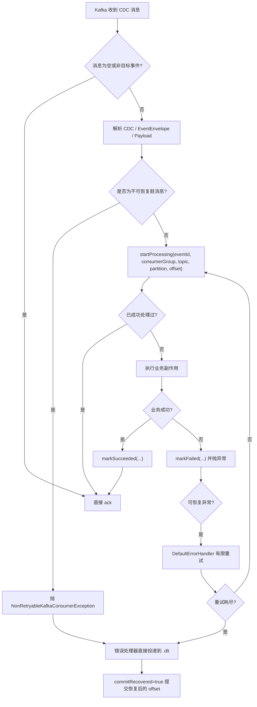

# Kafka 消费侧健壮性改造原理讲解

## 1. 背景：为什么 Kafka 真正的难点在消费侧

这次改造对应的是 CDC 到 Kafka 之后的下游消费链路。

上半段链路是：

1. 业务服务写 outbox
2. Debezium 把 outbox 变更投递到 Kafka

下半段链路是：

1. 消费者收到 CDC 消息
2. 解析事件
3. 执行业务副作用
4. 提交 offset

真正容易出问题的是下半段。因为面试官一旦听到“用了 Kafka”，通常会立刻追问：

1. 重复消费怎么办
2. 处理失败怎么办
3. 有没有死信队列
4. offset 什么时候提交
5. 消费者重启后从哪里继续消费

所以这次改造的重点不是“把 Kafka 接上”，而是把消费侧补成一条能自洽回答这些问题的可靠链路。

当前这次改造实际覆盖了两条 Java CDC 消费链：

1. `order-service` 的 `WalletBalanceOutboxCdcConsumer`
2. `social-service` 的 `ProductOutboxCdcConsumer`

---

## 2. 先把术语讲清楚

这一节是面试里最值钱的部分，因为很多人会背方案，但术语一追问就乱。

### 2.1 `at-least-once`

含义是：

1. Kafka 不保证一条消息只被业务处理一次
2. 它更实际的保证是“至少投递一次”
3. 所以重复消费是正常前提，不是异常情况

在这个项目里，我的设计就是接受“消息可能重复到达”，然后靠消费端幂等保证业务副作用不重复执行。

### 2.2 幂等

幂等的本质不是“消息只来一次”，而是：

> 同一条业务事件即使被重复消费，最终业务结果也只能落一次。

这次项目里的幂等键是 `eventId`，并且不是只放在内存里，而是持久化到本地消费日志表。

### 2.3 `ack`

`ack` 是消费者对 Kafka 的确认动作，表示：

> 这条消息我已经处理到可以提交 offset 了。

这次实现使用的是手动 `ack`，而不是让框架自动提交。目的就是把“业务成功”和“提交 offset”绑定起来。

### 2.4 `offset`

`offset` 是 Kafka 分区内消息的位置编号。它回答的是：

> 这个 consumer group 下次应该从哪里继续读。

要特别注意：

1. Kafka 里的 committed offset 决定“从哪里继续拉消息”
2. 本地消费日志决定“这条业务事件要不要再执行业务副作用”

这两者互补，但不能互相替代。

### 2.5 `consumer group`

`consumer group` 是消费位点和负载分摊的单位。

为什么本项目里的幂等表要用 `(consumer_group, event_id)` 做唯一键，而不是只用 `event_id`？

因为同一条事件可以被不同 consumer group 各自消费，而且它们可能承担不同业务职责。所以去重要区分 group 维度。

### 2.6 死信队列、`DLQ`、`DLT`

在 Kafka 语境里，更准确的说法其实是死信 `topic`，所以很多框架会用 `DLT`，即 `Dead Letter Topic`。

面试里大家经常口语化说“死信队列”，但你最好能补一句：

> Kafka 里更准确是死信 topic，不是传统消息队列语境里的 queue。

本项目里的实现是：

1. 原 topic 重试耗尽后
2. 或者遇到明确不可恢复的脏消息
3. 把消息路由到 `<原 topic>.dlt`
4. 分区号保持不变

### 2.7 重试

重试不是“出错就一直重放”，而是：

1. 只对可恢复异常重试
2. 次数有限
3. 耗尽后进入 DLT

当前代码里的配置是 `max-attempts=3`。从 `FixedBackOff(..., maxAttempts - 1)` 可以推断：

1. 第 1 次是首次消费
2. 后面最多再重试 2 次

也就是说，这里的 `max-attempts` 表示总尝试次数，不是额外重试次数。

### 2.8 `auto-offset-reset`

很多人会把这个点讲错。

`auto-offset-reset: latest` 不是“消费者每次重启都从最新消息开始读”，它只在以下场景生效：

1. 这个 consumer group 还没有 committed offset
2. 或者原来的 committed offset 已经无效

只要已有已提交 offset，消费者重启后仍然会从 committed offset 继续消费，而不是看 `latest`。

---

## 3. 方案总览：这次到底补了什么

这次 Kafka 消费侧补的是 5 件事：

1. 手动 `ack`，业务成功后再提交 offset
2. 基于 `eventId` 的持久化幂等
3. 可恢复异常有限重试
4. 不可恢复异常或重试耗尽进入 DLT
5. 消费日志记录 `topic / partition / offset / status / last_error`

可以把这套方案概括成一句话：

> Kafka 语义按 `at-least-once` 设计，消费端用持久化幂等兜住重复副作用，用重试和 DLT 兜住失败消息，用手动 ack 明确 offset 提交时机。

---

## 4. 整体处理流程



这个流程里有三个关键点：

1. 非目标消息直接 `ack`，避免无意义重试。
2. 不可恢复脏消息不进入重试，而是直接送 DLT。
3. 即使消息重复投递，只要 `eventId` 已成功处理过，就不会重复执行业务副作用。

---

## 5. 核心设计拆解

### 5.1 手动 `ack`：把 offset 提交点后移

`order-service` 和 `social-service` 都用了手动确认：

1. `@KafkaListener` 方法接收 `ConsumerRecord<String, String>` 和 `Acknowledgment`
2. 业务处理成功后显式调用 `acknowledge()`
3. 异常场景不手动 `ack`，交给错误处理器决定重试或 DLT

配置对齐 [`OrderKafkaConsumerConfiguration.java`](/Users/hhm/code/shiori/shiori-java/shiori-order-service/src/main/java/moe/hhm/shiori/order/config/OrderKafkaConsumerConfiguration.java) / [`SocialKafkaConsumerConfiguration.java`](/Users/hhm/code/shiori/shiori-java/shiori-social-service/src/main/java/moe/hhm/shiori/social/config/SocialKafkaConsumerConfiguration.java)：

```java
factory.getContainerProperties().setAckMode(ContainerProperties.AckMode.MANUAL_IMMEDIATE);
```

这一步的意义是：

1. 避免业务还没成功，offset 已经提前推进
2. 让“处理成功”和“提交 offset”成为同一个业务边界

### 5.2 错误处理器：有限重试 + DLT

这次两边都用了 `DefaultErrorHandler` + `DeadLetterPublishingRecoverer`。

关键配置对齐 [`OrderKafkaConsumerConfiguration.java`](/Users/hhm/code/shiori/shiori-java/shiori-order-service/src/main/java/moe/hhm/shiori/order/config/OrderKafkaConsumerConfiguration.java)：

```java
DeadLetterPublishingRecoverer recoverer = new DeadLetterPublishingRecoverer(
        kafkaOperations,
        (ConsumerRecord<?, ?> record, Exception ex) ->
                new TopicPartition(record.topic() + dltSuffix, record.partition())
);
DefaultErrorHandler errorHandler = new DefaultErrorHandler(
        recoverer,
        new FixedBackOff(Math.max(retryIntervalMs, 0L), Math.max(maxAttempts - 1L, 0L))
);
errorHandler.addNotRetryableExceptions(NonRetryableKafkaConsumerException.class);
errorHandler.setCommitRecovered(true);
```

这里可以拆成 4 个面试点：

1. `DeadLetterPublishingRecoverer`：把失败消息投递到 `<topic>.dlt`
2. `FixedBackOff`：控制重试间隔和次数
3. `addNotRetryableExceptions(...)`：脏消息不重试，直接进 DLT
4. `setCommitRecovered(true)`：消息一旦成功送进 DLT，就提交它的 offset，避免反复重放

这一点很容易被忽略，但很重要：

> 如果消息已经被正确隔离到 DLT，却不提交恢复后的 offset，它仍然可能继续卡住主消费链路。

### 5.3 什么算可恢复异常，什么算不可恢复异常

这次划分标准很明确。

可恢复异常：

1. 数据库瞬时失败
2. 业务写入失败
3. `order-service` 里余额事件触发退款重试，但本批次仍有失败

不可恢复异常：

1. CDC JSON 非法
2. `EventEnvelope` 非法
3. payload 缺失或结构不合法
4. `eventId` 缺失
5. 必要业务字段为空或非法

不可恢复异常统一抛 `NonRetryableKafkaConsumerException`，例如 [`WalletBalanceOutboxCdcConsumer.java`](/Users/hhm/code/shiori/shiori-java/shiori-order-service/src/main/java/moe/hhm/shiori/order/mq/WalletBalanceOutboxCdcConsumer.java)：

```java
if (!StringUtils.hasText(envelope.eventId())) {
    throw new NonRetryableKafkaConsumerException("wallet balance eventId is missing");
}
```

这背后的原则是：

> 继续重试一个脏消息不会让它变好，只会拖慢正常消费。

### 5.4 幂等：不是靠 Kafka 不重复，而是靠消费端不重复落副作用

两边都做了消费日志表去重。

`order-service`：

1. 表：`o_event_consume_log`
2. 唯一键：`(consumer_group, event_id)`

`social-service`：

1. 表：`s_event_consume_log`
2. 从原来的单 `event_id` 去重，升级为 `(consumer_group, event_id)` 唯一键

迁移文件对齐 [`V2__enhance_event_consume_log_for_kafka.sql`](/Users/hhm/code/shiori/shiori-java/shiori-social-service/src/main/resources/db/migration/V2__enhance_event_consume_log_for_kafka.sql)：

```sql
ALTER TABLE s_event_consume_log
    DROP INDEX uk_s_event_consume_log_event_id,
    ADD UNIQUE KEY uk_s_event_consume_log_group_event (consumer_group, event_id),
    ADD KEY idx_s_event_consume_log_status_updated (status, updated_at, id);
```

消费日志状态机是：

1. `PROCESSING`
2. `SUCCEEDED`
3. `FAILED`

`startProcessing(...)` 的逻辑对齐 [`KafkaConsumeLogService.java`](/Users/hhm/code/shiori/shiori-java/shiori-order-service/src/main/java/moe/hhm/shiori/order/mq/KafkaConsumeLogService.java)：

```java
@Transactional(propagation = Propagation.REQUIRES_NEW)
public boolean startProcessing(String eventId, String eventType, KafkaMessageMetadata metadata) {
    KafkaConsumeLogRecord existed = kafkaConsumeLogMapper.findByConsumerGroupAndEventId(
            metadata.consumerGroup(),
            eventId
    );
    if (existed != null && STATUS_SUCCEEDED.equalsIgnoreCase(existed.status())) {
        return false;
    }

    KafkaConsumeLogEntity entity = toEntity(eventId, eventType, metadata);
    entity.setStatus(STATUS_PROCESSING);
    entity.setLastError(null);
    kafkaConsumeLogMapper.upsert(entity);
    return true;
}
```

这里的关键含义是：

1. 如果同一 `consumerGroup + eventId` 已经成功过，就直接跳过
2. 否则把当前处理位置和状态写入日志

`upsert(...)` 还有一个细节值得讲，对齐 [`KafkaConsumeLogMapper.java`](/Users/hhm/code/shiori/shiori-java/shiori-order-service/src/main/java/moe/hhm/shiori/order/repository/KafkaConsumeLogMapper.java)：

```sql
status = CASE
    WHEN status = 'SUCCEEDED' THEN status
    ELSE VALUES(status)
END
```

这表示：

> 一旦某条事件已经标记为 `SUCCEEDED`，后续重复投递不会把它重新覆盖成 `PROCESSING` 或 `FAILED`。

这就是消费端幂等的核心保护。

### 5.5 为什么消费日志还要记 `topic / partition / offset / last_error`

这不是为了替代 Kafka 的 offset 管理，而是为了排障和审计。

落库字段至少包括：

1. `consumer_group`
2. `event_id`
3. `event_type`
4. `topic`
5. `partition_id`
6. `message_offset`
7. `status`
8. `last_error`
9. `processed_at`

它能解决三个问题：

1. 某条消息失败后，可以直接定位到分区和位点
2. 可以知道它是重试中、已成功还是已失败
3. 后续如果要做 DLT 回放或人工补偿，有明确依据

### 5.6 `REQUIRES_NEW` 的意义：失败日志不要跟业务回滚一起丢

`startProcessing(...)` 和 `markFailed(...)` 都用了 `REQUIRES_NEW`。

这意味着：

1. 即使外层业务事务失败回滚
2. 开始处理记录和失败记录也尽量单独落库

这样做的价值是：

1. 不会出现“业务失败了，但失败痕迹也一起回滚掉”的情况
2. 对排障更友好

### 5.7 `order-service` 额外修掉了“吞错即成功”的坑

这次 `order-service` 最关键的业务修正，不只是补了消费日志。

原来退款自动重试这段批量逻辑会：

1. catch 单条失败
2. 只打日志
3. 不向上抛异常

这样 Kafka 消费器会误以为整条消息处理成功。

现在 `WalletBalanceOutboxCdcConsumeService` 改成调用 [`retryPendingRefundsBySellerOrThrow(...)`](/Users/hhm/code/shiori/shiori-java/shiori-order-service/src/main/java/moe/hhm/shiori/order/service/OrderRefundService.java)：

```java
public void handle(String eventId, WalletBalanceChangedPayload payload, KafkaMessageMetadata metadata) {
    if (!kafkaConsumeLogService.startProcessing(eventId, "WalletBalanceChanged", metadata)) {
        return;
    }
    try {
        orderRefundService.retryPendingRefundsBySellerOrThrow(payload.userId());
        kafkaConsumeLogService.markSucceeded(eventId, metadata);
    } catch (RuntimeException ex) {
        kafkaConsumeLogService.markFailed(eventId, metadata, ex);
        throw ex;
    }
}
```

对应的抛错逻辑对齐 [`OrderRefundService.java`](/Users/hhm/code/shiori/shiori-java/shiori-order-service/src/main/java/moe/hhm/shiori/order/service/OrderRefundService.java)：

```java
if (throwOnFailure && !failedRefundNos.isEmpty()) {
    throw new OrderRefundBatchRetryException(sellerUserId, failedRefundNos.size());
}
```

这一步的意义非常大：

1. Kafka 场景下，只要批次里仍有失败，就必须让消费失败可见
2. 这样错误处理器才能继续走重试或 DLT
3. 否则消息会被误判为成功，offset 被推进，业务失败却无法回放

### 5.8 真实联调额外暴露了一个 Spring Boot 4 运行时装配点

这次如果只看单测，其实不一定能立刻发现运行时问题。

真实联调时我还踩到了一个很典型的坑：

1. 仅引入 `spring-kafka` 并不够
2. Spring Boot 4 下还需要显式引入 `spring-boot-kafka`
3. 否则运行时不会自动生成 `KafkaTemplate / KafkaOperations / ConsumerFactory`
4. 结果就是错误处理器里注入 `KafkaOperations` 失败，消费者根本起不来

依赖修正对齐 [`build.gradle`](/Users/hhm/code/shiori/shiori-java/shiori-order-service/build.gradle) / [`build.gradle`](/Users/hhm/code/shiori/shiori-java/shiori-social-service/build.gradle)：

```groovy
implementation 'org.springframework.boot:spring-boot-kafka'
implementation 'org.springframework.kafka:spring-kafka'
```

我还补了两类测试把这个问题固定住：

1. 配置装配测试：验证 `CommonErrorHandler` 和 `kafkaListenerContainerFactory` 能创建
2. 自动配置集成测试：验证 `KafkaOperations / ConsumerFactory` 在真实 Boot 自动配置下确实存在

对应测试文件：

1. [`OrderKafkaAutoConfigurationIntegrationTest.java`](/Users/hhm/code/shiori/shiori-java/shiori-order-service/src/test/java/moe/hhm/shiori/order/config/OrderKafkaAutoConfigurationIntegrationTest.java)
2. [`SocialKafkaAutoConfigurationIntegrationTest.java`](/Users/hhm/code/shiori/shiori-java/shiori-social-service/src/test/java/moe/hhm/shiori/social/config/SocialKafkaAutoConfigurationIntegrationTest.java)

---

## 6. 消费者重启后从哪里开始消费

这是面试必问点，必须讲精确。

正确回答是：

1. 优先从 Kafka 已提交 offset 继续消费
2. 只有在 group 没有 committed offset，或者 committed offset 无效时，才会看 `auto-offset-reset`
3. 当前配置是 `auto-offset-reset: latest`

也就是说：

1. 正常重启：从上次已提交 offset 继续
2. 全新 group 首次启动：从最新位置开始读

本地消费日志不负责决定读取起点，它只负责：

1. 幂等
2. 审计
3. 排障

这句话面试时一定要说清楚。

---

## 7. 真实联调证据：这套方案不是只停留在设计图上

这次我实际做了一轮本地 Docker + MySQL + Kafka + Nacos 的真实联调，不是只停留在单测。

联调时间：

1. 2026-03-27
2. 本地 `docker compose` 环境
3. `order-service` 与 `social-service` 都使用真实容器启动

为了把两条链路都跑起来，我做了两件事：

1. 修复了本地 MySQL 历史数据卷里的账号密码漂移，否则服务都起不来
2. 临时把 Nacos 里的 `order.kafka.enabled` 打开做验证，联调后已恢复原状态

### 7.1 启动证据

真实启动后，两边消费者都成功订阅了目标 topic：

1. `order-service` 订阅 `shiori.cdc.payment.outbox.raw`
2. `social-service` 订阅 `shiori.cdc.product.outbox.raw`

日志里可以看到：

1. consumer group 完成 join / assignment
2. 分区分配成功
3. `Started ...Application`

这说明：

1. Kafka 自动配置生效了
2. 错误处理器和监听容器都真正加载了
3. 不再是“代码写了，但运行时起不来”

### 7.2 成功链路验证：重复消息只落一次

我手工向两个 raw topic 各发了两次相同的成功消息。

`social-service` 验证样本：

1. `event_id = it-social-ok-1774546040`
2. 目标商品号：`ITP1774546040`

实际结果：

1. `s_event_consume_log` 中该事件状态是 `SUCCEEDED`
2. 同一 `event_id` 重复投递两次后，日志计数仍然是 `1`
3. `s_post` 中 `related_product_no = ITP1774546040` 的帖子数是 `1`

这证明：

1. Kafka 层面消息确实重复到达了
2. 但消费端幂等把重复副作用挡住了

`order-service` 验证样本：

1. `event_id = it-order-ok-1774546040`

实际结果：

1. `o_event_consume_log` 中该事件状态是 `SUCCEEDED`
2. 同一 `event_id` 重复投递两次后，日志计数仍然是 `1`

这说明 `order-service` 这条链路也满足“重复消息不重复落副作用”的设计目标。

### 7.3 失败链路验证：坏消息进入 DLT，不堵主链路

我又分别向两个 raw topic 发了 payload 非法的脏消息：

1. `it-social-bad-1774546040`
2. `it-order-bad-1774546040`

实际结果：

1. `it-social-bad-1774546040` 出现在 `shiori.cdc.product.outbox.raw.dlt`
2. `it-order-bad-1774546040` 出现在 `shiori.cdc.payment.outbox.raw.dlt`

同时数据库查询结果是：

1. `SOCIAL_BAD_LOG_COUNT = 0`
2. `ORDER_BAD_LOG_COUNT = 0`

这正符合当前实现的预期：

1. 脏消息在解析阶段就被识别为不可恢复异常
2. 它不会进入正常业务处理
3. 也不会被错误记成成功消费日志
4. 而是直接由错误处理器送入 DLT

### 7.4 这轮联调最终证明了什么

这轮真实联调至少证明了 4 件事：

1. 消费者能在真实容器环境里成功启动和订阅 Kafka
2. 重复消息会被消费端幂等拦住，不会重复落副作用
3. 脏消息会进入 DLT，而不是反复卡住主消费链路
4. 这套方案不只是“理论上可讲”，而是已经在本地端到端跑通过

---

## 8. 几个关键边界，不能夸大

### 8.1 这不是端到端 `exactly-once`

这次方案不是“端到端只执行一次”，而是：

1. Kafka `at-least-once`
2. 消费端持久化幂等

这是一个更务实、也更符合当前项目实现的说法。

### 8.2 这次做到了 DLT 隔离，但没有做 DLT 回放平台

当前已经做到：

1. 主链路重试
2. 重试耗尽转 DLT
3. 消费日志可定位

但还没有做到：

1. DLT 可视化管理平台
2. 自动回放工具
3. 运维回灌流程

### 8.3 这次不是全项目所有消费者都完全统一

当前主要补齐的是：

1. `order-service`
2. `social-service`

所以面试里可以说“这两条 Java CDC 消费链已经按统一模式改造”，但不要夸大成“全项目所有消费者都完全统一”。

---

## 9. 代码落点

面试时可以直接引用这些文件：

1. [`OrderKafkaConsumerConfiguration.java`](/Users/hhm/code/shiori/shiori-java/shiori-order-service/src/main/java/moe/hhm/shiori/order/config/OrderKafkaConsumerConfiguration.java)
2. [`WalletBalanceOutboxCdcConsumer.java`](/Users/hhm/code/shiori/shiori-java/shiori-order-service/src/main/java/moe/hhm/shiori/order/mq/WalletBalanceOutboxCdcConsumer.java)
3. [`WalletBalanceOutboxCdcConsumeService.java`](/Users/hhm/code/shiori/shiori-java/shiori-order-service/src/main/java/moe/hhm/shiori/order/mq/WalletBalanceOutboxCdcConsumeService.java)
4. [`KafkaConsumeLogService.java`](/Users/hhm/code/shiori/shiori-java/shiori-order-service/src/main/java/moe/hhm/shiori/order/mq/KafkaConsumeLogService.java)
5. [`KafkaConsumeLogMapper.java`](/Users/hhm/code/shiori/shiori-java/shiori-order-service/src/main/java/moe/hhm/shiori/order/repository/KafkaConsumeLogMapper.java)
6. [`OrderRefundService.java`](/Users/hhm/code/shiori/shiori-java/shiori-order-service/src/main/java/moe/hhm/shiori/order/service/OrderRefundService.java)
7. [`SocialKafkaConsumerConfiguration.java`](/Users/hhm/code/shiori/shiori-java/shiori-social-service/src/main/java/moe/hhm/shiori/social/config/SocialKafkaConsumerConfiguration.java)
8. [`ProductOutboxCdcConsumer.java`](/Users/hhm/code/shiori/shiori-java/shiori-social-service/src/main/java/moe/hhm/shiori/social/mq/ProductOutboxCdcConsumer.java)
9. [`ProductOutboxCdcConsumeService.java`](/Users/hhm/code/shiori/shiori-java/shiori-social-service/src/main/java/moe/hhm/shiori/social/mq/ProductOutboxCdcConsumeService.java)
10. [`KafkaConsumeLogService.java`](/Users/hhm/code/shiori/shiori-java/shiori-social-service/src/main/java/moe/hhm/shiori/social/mq/KafkaConsumeLogService.java)
11. [`KafkaConsumeLogMapper.java`](/Users/hhm/code/shiori/shiori-java/shiori-social-service/src/main/java/moe/hhm/shiori/social/repository/KafkaConsumeLogMapper.java)
12. [`V2__enhance_event_consume_log_for_kafka.sql`](/Users/hhm/code/shiori/shiori-java/shiori-social-service/src/main/resources/db/migration/V2__enhance_event_consume_log_for_kafka.sql)
13. [`application.yml`](/Users/hhm/code/shiori/shiori-java/shiori-order-service/src/main/resources/application.yml)
14. [`application.yml`](/Users/hhm/code/shiori/shiori-java/shiori-social-service/src/main/resources/application.yml)
15. [`build.gradle`](/Users/hhm/code/shiori/shiori-java/shiori-order-service/build.gradle)
16. [`build.gradle`](/Users/hhm/code/shiori/shiori-java/shiori-social-service/build.gradle)
17. [`OrderKafkaAutoConfigurationIntegrationTest.java`](/Users/hhm/code/shiori/shiori-java/shiori-order-service/src/test/java/moe/hhm/shiori/order/config/OrderKafkaAutoConfigurationIntegrationTest.java)
18. [`SocialKafkaAutoConfigurationIntegrationTest.java`](/Users/hhm/code/shiori/shiori-java/shiori-social-service/src/test/java/moe/hhm/shiori/social/config/SocialKafkaAutoConfigurationIntegrationTest.java)
19. [`OrderKafkaConsumerConfigurationTest.java`](/Users/hhm/code/shiori/shiori-java/shiori-order-service/src/test/java/moe/hhm/shiori/order/config/OrderKafkaConsumerConfigurationTest.java)
20. [`SocialKafkaConsumerConfigurationTest.java`](/Users/hhm/code/shiori/shiori-java/shiori-social-service/src/test/java/moe/hhm/shiori/social/config/SocialKafkaConsumerConfigurationTest.java)

---

## 10. 面试时怎么讲最顺

建议按下面顺序讲：

1. 先讲语义：我按 `at-least-once` 设计，不假设消息只会来一次。
2. 再讲幂等：基于 `eventId` 和 `consumerGroup` 做持久化去重。
3. 再讲失败处理：可恢复异常有限重试，不可恢复异常或重试耗尽进 DLT。
4. 再讲 offset：业务成功后手动 `ack`，消费者重启从 Kafka 已提交 offset 继续。
5. 最后讲项目细节：`order-service` 额外修了“吞错即成功”的问题。
6. 如果面试官继续追问“你怎么证明真的跑过”，就补真实联调证据：重复消息只落一次，脏消息实际进了 DLT。

可以直接背下面这段：

> 我这次补的是 Kafka 消费侧的可靠性闭环，不只是把消息接进来。语义上我按 `at-least-once` 设计，也就是接受消息可能重复投递，然后用消费端幂等保证业务副作用只落一次。
> 具体做法是：每条事件都带 `eventId`，消费前先查本地消费日志，按 `(consumerGroup, eventId)` 做持久化去重；如果已成功处理过就直接跳过。消费成功后才手动 `ack`，让 offset 提交和业务成功绑定。
> 失败处理上，我用 `DefaultErrorHandler` 做有限重试，用 `DeadLetterPublishingRecoverer` 把不可恢复异常或重试耗尽的消息送到 `<topic>.dlt`，并通过 `commitRecovered=true` 提交恢复后的 offset，避免死信消息继续卡住主链路。
> 另外我还把 `topic、partition、offset、status、last_error` 落到消费日志表里，方便排障。在 `order-service` 里，我还修了一个关键问题：原来退款批量重试会吞掉单条失败，导致 Kafka 误判成功；现在改成 Kafka 场景下只要批次里还有失败就抛异常，这样消息才能继续走重试或 DLT。
> 这套方案我还做了真实联调，不只是单测：我实际发过重复消息和脏消息，验证过成功消息只落一次、坏消息会进入 DLT。
