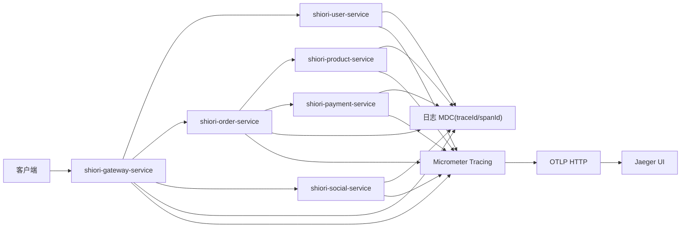

# 分布式链路追踪改造原理讲解

## 1. 背景：为什么日志不够

改造前，项目里已经有日志，也已经补了 Prometheus + Grafana 指标闭环，但跨服务问题仍然有一个明显短板：

1. 某个请求失败时，能看到单个服务报错。
2. 能看到总体延迟和错误率变化。
3. 但很难直接回答“这一单到底经过了哪些服务、哪一跳最慢”。

这类问题如果只靠日志，通常要做三件事：

1. 去网关日志里找入口时间。
2. 去下游服务日志里靠时间窗口拼接。
3. 再靠经验猜是哪一跳出问题。

所以这次做分布式链路追踪的核心价值，不是新增一个炫技中间件，而是把“跨服务靠猜”变成“按 TraceId 直接看链路图”。

---

## 2. 方案选择：为什么是 Micrometer Tracing + OTLP + Jaeger

这次选型的思路是中等成本、足够工程化，不追求最重方案。

### 2.1 为什么选 Micrometer Tracing

因为项目本身就是 Spring Boot，Micrometer Tracing 能直接复用 Spring Boot 4 的自动配置能力：

1. 接入成本低。
2. 和现有 Actuator / Observation 体系一致。
3. 不需要额外引入一套完全独立的 tracing 基础设施。

### 2.2 为什么选 OpenTelemetry OTLP

因为 OTLP 是现在更通用的导出协议，后续如果想切换后端，不需要重写应用埋点。

这里的思路是：

1. 应用侧尽量标准化。
2. 后端选 Jaeger 只是当前展示和排障工具。
3. 以后如果换 collector 或别的后端，应用改动最小。

### 2.3 为什么选 Jaeger，不选 Zipkin

这次更看重“本地能快速跑起来 + UI 直观看链路”。

Jaeger all-in-one 的优点是：

1. Docker 起一个容器就能看 UI。
2. OTLP 支持直接打开。
3. 面试演示时更容易直观展示 span 树和每一跳耗时。

所以这次不是说 Zipkin 不行，而是 Jaeger 更适合当前项目阶段。

---

## 3. 整体架构：链路追踪是怎么打通的



这条链路的关键不是“单个服务能产 span”，而是：

1. 网关创建入口 trace。
2. 服务间 HTTP 调用自动透传 `traceparent`。
3. 日志能打印 `traceId/spanId`。
4. 最终在 Jaeger 中能拼成一棵完整的调用树。

---

## 4. 这次最关键的技术点：不是加 starter，而是修 Builder

### 4.1 表面看起来只是加了 OTel Starter

六个 Java 服务都补了：

```gradle
implementation 'org.springframework.boot:spring-boot-starter-opentelemetry'
```

但如果只停在这里，链路追踪并不一定真正生效。

### 4.2 真正的坑：手写 Builder 会绕过自动注入

这次排查时发现，项目里原来有自定义的：

1. `RestClient.builder()`
2. `WebClient.builder()`

这种写法的问题是：

1. `@LoadBalanced` 还在。
2. 业务调用还能跑。
3. 但 Boot 自动注入到官方 builder 上的 observation / tracing 拦截器会被绕开。

结果就是：

1. 业务没坏。
2. tracing 配置也看起来打开了。
3. 但请求头里没有 `traceparent`。

另外这里还要补一个工程细节：这次只打算导出 trace，不打算把 metrics 和日志也切到 OTLP。

所以我还显式关掉了：

1. `management.otlp.metrics.export.enabled`
2. `management.logging.export.otlp.enabled`

这样可以继续保留现有 Prometheus 指标链路，避免 starter 默认把指标往 `4318/v1/metrics` 推送。

这是很典型、也很有面试价值的工程细节。

### 4.3 最终修法

订单和用户服务改成：

1. 用 `RestClientBuilderConfigurer` 派生 `@LoadBalanced RestClient.Builder`

Gateway 改成：

1. 用 `WebClientCustomizer` 链派生 `@LoadBalanced WebClient.Builder`

这样保住了两件事：

1. Spring Cloud 负载均衡能力
2. Spring Boot Observation / Tracing 自动拦截器

---

## 5. 传播协议：为什么统一 W3C traceparent

这次明确统一成 W3C：

```yaml
management:
  tracing:
    propagation:
      consume: [w3c]
      produce: [w3c]
```

原因很直接：

1. `traceparent` 是更通用的标准。
2. Java 生态原生支持好。
3. 以后补 Go 服务或别的语言时更容易统一。
4. 避免现在同时写 `b3` 和 `w3c`，后面再做一次迁移。

所以这里不是“能传就行”，而是先把跨语言兼容的标准选对。

---

## 6. 日志关联：为什么还要把 traceId/spanId 打到日志里

分布式追踪不是为了替代日志，而是和日志互补。

这次统一加了：

```yaml
logging:
  include-application-name: false
  pattern:
    correlation: "[${spring.application.name:},%X{traceId:-},%X{spanId:-}] "
```

这样做有两个价值：

1. 在 Jaeger 里找到一条慢链路后，可以拿 `traceId` 反查具体服务日志。
2. 在日志里先看到错误后，也可以拿 `traceId` 回到 Jaeger 看上下游耗时。

也就是说：

1. Trace 适合看“全链路拓扑与耗时”。
2. 日志适合看“具体异常与业务上下文”。

---

## 7. 配置策略：为什么源码默认关，Nacos 模板默认开

这个细节很重要，因为它体现了工程化权衡，而不是只追求“能跑”。

### 7.1 源码 `application.yml` 默认关闭

```yaml
management:
  tracing:
    enabled: ${TRACING_ENABLED:false}
```

原因是：

1. 很多人本地只起单服务。
2. 如果默认就导出 OTLP，而 Jaeger 没起，会一直刷 exporter 错误。
3. 这会影响纯本地调试体验。

### 7.2 Nacos 模板默认开启

```yaml
management:
  tracing:
    enabled: ${TRACING_ENABLED:true}
```

因为在 Docker 联调、演示环境、面试展示环境里，更重要的是开箱可见：

1. 服务一起来就能看到 trace。
2. 不需要每次手动改开关。

这个设计的本质是：

1. 单服务本地调试优先稳定。
2. 多服务联调和演示优先可见。

---

## 8. 测试与验证：这次怎么证明不是“只写了配置”

这次没有只停在文档和配置上，而是补了定向测试验证 header 透传。

### 8.1 测试目标

验证以下 builder 发请求时会自动带 `traceparent`：

1. `loadBalancedRestClientBuilder`
2. `loadBalancedWebClientBuilder`

### 8.2 测试思路

做法是：

1. 手动创建一个活动 Observation
2. 用 builder 发请求
3. 断言请求头里有 `traceparent`

### 8.3 中间排查到的真实问题

一开始测试虽然有 Observation，但请求头仍然没有 `traceparent`。

根因不是业务代码，而是测试最小上下文少导入了一层：

1. `MicrometerTracingAutoConfiguration`

这层里才真正注册了：

1. `PropagatingSenderTracingObservationHandler`
2. `PropagatingReceiverTracingObservationHandler`

这说明这次不是“拍脑袋改配置”，而是把 tracing handler、builder 来源和透传链路都实际走通了。

---

## 9. 面试里怎么讲这次改造

这次最有价值的一句话其实是：

> 我能通过 TraceId 在 Jaeger 里看到一个请求经过了哪些服务、每个服务耗时多少，然后再拿同一个 TraceId 回查日志定位具体异常。

这句话背后的工程点包括：

1. 统一了 W3C `traceparent`
2. 解决了自定义 HTTP client 绕过自动 tracing 的问题
3. 把日志和 trace 做了双向关联
4. 把本地运行链路补到了 Jaeger UI

---

## 10. 当前边界：哪些要实话实说

这题最忌讳过度表述。

当前可以明确说的：

1. Java HTTP 主链路已经接入 tracing。
2. Gateway 到下游 Java 服务的 `traceparent` 已验证自动透传。
3. 日志已支持 `traceId/spanId` 关联。
4. Jaeger 本地可视化链路已补齐。

当前不要夸大的：

1. Go `shiori-notify-service` 也已经接入 tracing。
2. Kafka 异步消息链路已经完整可视化。
3. 所有跨语言链路都已经统一验证完成。

最稳妥的表达应该是：

> 我先把 Java 微服务主 HTTP 链路打通了，能在 Jaeger 里看同步请求路径和每一跳耗时；Go 服务和异步消息链路是下一阶段补齐项。
