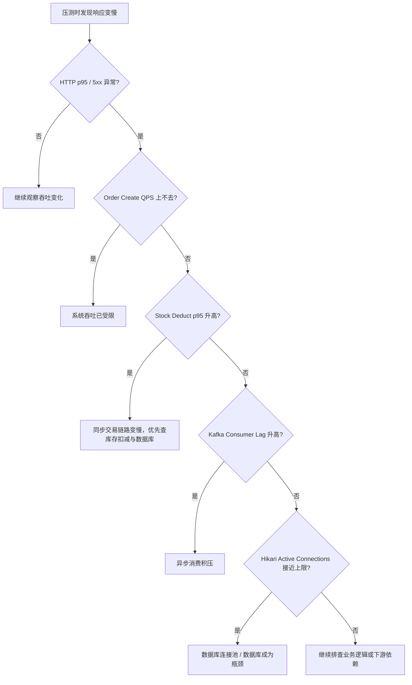

# 可观测性改造原理讲解

## 1. 背景：为什么这次不是“把 Grafana 跑起来”就算完

改造前，项目已经能做压测，也能看应用日志，但这两类信息只能回答一半问题：

1. 系统是不是变慢了。
2. 系统有没有报错。

它们回答不了更关键的问题：

1. 到底是哪一层先到瓶颈。
2. 是同步请求慢了，还是异步链路积压了。
3. 是库存扣减慢了，还是数据库连接池先打满了。

所以这次可观测性改造的目标，不是堆很多监控名词，而是补出一个最小可用闭环：

1. 应用暴露 Prometheus 指标。
2. Prometheus 周期性采集。
3. Grafana 用预置总览面板展示最关键的瓶颈信号。
4. 能把压测现象和运行时指标对应起来。

---

## 2. 整体架构：指标链路是怎么打通的


仓库里的真实链路如下：

1. 多个 Java 服务在 `application.yml` 里暴露 `/actuator/prometheus`
2. [`prometheus.yml`](/Users/hhm/code/shiori/deploy/observability/prometheus.yml) 对各服务做定时抓取
3. [`shiori-overview.json`](/Users/hhm/code/shiori/deploy/observability/grafana/dashboards/shiori-overview.json) 预置关键面板

这套链路的价值不是“有图可看”，而是能在压测或演示时快速判断瓶颈位于入口、数据库、库存核心链路还是 Kafka 消费侧。

---

## 3. 这次为什么选这几类指标

这次没有追求大而全，而是只挑了对“压测定位”和“面试解释”最有价值的指标。

| 指标 | 真实来源 | 解释什么问题 | 面试价值 |
| --- | --- | --- | --- |
| 订单创建 QPS | `shiori_order_transition_total{from="NEW",to="UNPAID"}` | 订单创建吞吐是否跟上流量 | 可以解释业务吞吐 |
| 库存扣减延迟 | `shiori_product_stock_deduct_latency_seconds` | 同步交易关键路径是否变慢 | 可以解释核心路径耗时 |
| Kafka 消费 lag | `shiori_order_kafka_consumer_lag_seconds` | 异步消费是否积压 | 可以解释异步链路滞后 |
| Hikari 活跃连接数 | `hikaricp_connections_active` | 数据库连接池是否逼近上限 | 可以解释数据库资源瓶颈 |
| HTTP QPS / p95 / 5xx | Actuator 默认指标 | 哪个服务先慢、先报错 | 可以解释系统总体健康度 |

这里的设计思路是：

1. 先用 HTTP 总览判断“哪里有问题”。
2. 再用业务指标判断“为什么有问题”。
3. 最后把同步链路、异步链路、连接池三类证据拼起来。

---

## 4. 配置与采集：指标是怎么暴露出来的

### 4.1 应用侧：统一暴露 `/actuator/prometheus`

以下配置对齐多个服务的 [`application.yml`](/Users/hhm/code/shiori/shiori-java/shiori-order-service/src/main/resources/application.yml) / [`application.yml`](/Users/hhm/code/shiori/shiori-java/shiori-product-service/src/main/resources/application.yml)：

```yaml
management:
  endpoints:
    web:
      exposure:
        include: health,info,prometheus,metrics
  endpoint:
    health:
      probes:
        enabled: true
  prometheus:
    metrics:
      export:
        enabled: true
  metrics:
    tags:
      application: ${spring.application.name}
```

目前仓库里明确暴露了 Prometheus 指标的核心服务包括：

1. `shiori-gateway-service`
2. `shiori-user-service`
3. `shiori-product-service`
4. `shiori-order-service`
5. `shiori-payment-service`

### 4.2 Prometheus 侧：定时抓取业务服务

以下片段对齐 [`prometheus.yml`](/Users/hhm/code/shiori/deploy/observability/prometheus.yml)：

```yaml
scrape_configs:
  - job_name: shiori-product-metrics
    metrics_path: /actuator/prometheus
    static_configs:
      - targets:
          - shiori-product-service:8082

  - job_name: shiori-order-metrics
    metrics_path: /actuator/prometheus
    static_configs:
      - targets:
          - shiori-order-service:8083
```

这说明可观测性不是“只在代码里埋点”，而是应用暴露、Prometheus 抓取、Grafana 展示三层都打通了。

---

## 5. 关键业务指标：真实代码怎么埋的

### 5.1 订单创建 QPS：复用状态迁移指标

这次没有额外造一个“订单创建 counter”，而是复用了订单状态迁移指标。原因是：在当前业务里，订单创建成功后一定会从 `NEW` 进入 `UNPAID`。

Grafana 面板用的 PromQL 对齐 [`shiori-overview.json`](/Users/hhm/code/shiori/deploy/observability/grafana/dashboards/shiori-overview.json)：

```promql
sum(rate(shiori_order_transition_total{job="shiori-order-metrics",from="NEW",to="UNPAID"}[1m]))
```

这是“近似观测”，不是独立埋点，但在当前系统里足够反映订单创建吞吐。

### 5.2 库存扣减延迟：记录关键同步链路耗时

以下片段对齐 [`ProductStockService.java`](/Users/hhm/code/shiori/shiori-java/shiori-product-service/src/main/java/moe/hhm/shiori/product/service/ProductStockService.java)：

```java
@Transactional(rollbackFor = Exception.class)
public StockOperateResponse deduct(StockDeductRequest request) {
    long startNanos = System.nanoTime();
    String result = "unknown";
    try {
        StockOperateResponse response = operateStock(
                request.bizNo(), request.skuId(), request.quantity(), StockOpType.DEDUCT);
        result = response.idempotent() ? "idempotent_success" : "success";
        return response;
    } catch (BizException ex) {
        result = ProductErrorCode.STOCK_NOT_ENOUGH.equals(ex.getErrorCode()) ? "stock_not_enough" : "error";
        throw ex;
    } finally {
        productMetrics.recordStockDeductLatency(
                result, Duration.ofNanos(System.nanoTime() - startNanos));
    }
}
```

对应的指标注册逻辑在 [`ProductMetrics.java`](/Users/hhm/code/shiori/shiori-java/shiori-product-service/src/main/java/moe/hhm/shiori/product/service/ProductMetrics.java)：

```java
public void recordStockDeductLatency(String result, Duration duration) {
    Timer.builder("shiori_product_stock_deduct_latency_seconds")
            .tag("result", sanitize(result))
            .publishPercentileHistogram()
            .register(meterRegistry)
            .record(duration);
}
```

Grafana 面板看的是 p95：

```promql
histogram_quantile(
  0.95,
  sum(rate(shiori_product_stock_deduct_latency_seconds_bucket{job="shiori-product-metrics",result="success"}[5m])) by (le)
)
```

这能直接回答“为什么看 p95 不看平均值”：因为尾延迟更能暴露争用和慢路径。

### 5.3 Kafka 消费 lag：记录消息从写入到被处理的时间差

指标注册逻辑对齐 [`OrderMetrics.java`](/Users/hhm/code/shiori/shiori-java/shiori-order-service/src/main/java/moe/hhm/shiori/order/service/OrderMetrics.java)：

```java
public void recordKafkaConsumerLagSeconds(String consumer, double lagSeconds) {
    AtomicLong gaugeValue = kafkaConsumerLagGaugeValues.computeIfAbsent(
            sanitize(consumer),
            key -> meterRegistry.gauge(
                    "shiori_order_kafka_consumer_lag_seconds",
                    Tags.of("consumer", key),
                    new AtomicLong(0L),
                    value -> value.doubleValue() / 1000.0d
            )
    );
    gaugeValue.set(Math.round(Math.max(lagSeconds, 0.0d) * 1000.0d));
}
```

消费者侧的 lag 计算逻辑对齐 [`WalletBalanceOutboxCdcConsumer.java`](/Users/hhm/code/shiori/shiori-java/shiori-order-service/src/main/java/moe/hhm/shiori/order/mq/WalletBalanceOutboxCdcConsumer.java)：

```java
if (record != null && record.timestamp() > 0) {
    double lagSeconds = Math.max((System.currentTimeMillis() - record.timestamp()) / 1000.0d, 0.0d);
    orderMetrics.recordKafkaConsumerLagSeconds(CONSUMER_NAME, lagSeconds);
}
```

Grafana 面板用的是：

```promql
max(shiori_order_kafka_consumer_lag_seconds{job="shiori-order-metrics"}) by (consumer)
```

这里要实话实说：

1. 这不是 broker 侧最标准的 consumer group lag。
2. 它更准确地说是“消息从写入 Kafka 到当前消费者处理时的延迟”。
3. 但它接入成本低、改造小，足够支撑本地排障和面试演示。

### 5.4 连接池活跃连接数：直接复用默认指标

`hikaricp_connections_active` 不是手写埋点，而是 Hikari + Micrometer 默认暴露的指标。

Grafana 面板用的是：

```promql
hikaricp_connections_active{job=~"shiori-(user|product|order|payment)-metrics"}
```

它最大的价值是和延迟一起看：

1. 延迟升高且连接池逼近上限，优先怀疑数据库资源压力。
2. 延迟升高但连接池并不高，更可能是业务逻辑、外部依赖或异步链路问题。

---

## 6. Dashboard 怎么帮助定位问题



这张图的意义是：面试时你不仅能说“我接了监控”，还能说“我会怎么用这些监控定位”。

---

## 7. Grafana 面板：仓库里有哪些真实面板

当前预置总览面板 `Shiori Overview` 至少包含以下面板：

1. `Order Create QPS`
2. `Stock Deduct p95 Latency`
3. `Kafka Consumer Lag`
4. `Hikari Active Connections`
5. `HTTP QPS`
6. `HTTP p95 Latency`
7. `HTTP 5xx Ratio`
8. `Order Command Processing`

这套面板组合覆盖了：

1. 入口流量
2. 核心同步路径
3. 异步消费路径
4. 数据库资源
5. 业务命令处理

---

## 8. 验证边界：哪些已经跑通，哪些还不能夸大

这部分面试里必须实话实说。

已经验证的事实：

1. Grafana 服务本体能启动。
2. Prometheus 服务本体能启动。
3. Grafana datasource provisioning 已加载。
4. `Shiori Overview` 总览面板已自动加载。
5. 应用侧和 Grafana 侧的关键指标、PromQL、面板名称都已经落在仓库里。

仍然受本地环境影响的部分：

1. 多个业务服务容器因为 MySQL 旧数据卷密码不一致而反复重启。
2. 这会导致 Prometheus 对部分业务服务的抓取 target 不稳定，可能出现 `down/EOF`。
3. 因此不能夸大为“本地已经完整稳定地观测到所有业务指标曲线”。

更准确的表述应该是：

> 可观测性基础设施和面板预置已经跑通，但完整业务指标展示仍受本地环境问题影响。

---

## 9. 代码与配置落点

面试时可以直接引用这些文件：

1. [`OrderMetrics.java`](/Users/hhm/code/shiori/shiori-java/shiori-order-service/src/main/java/moe/hhm/shiori/order/service/OrderMetrics.java)
2. [`WalletBalanceOutboxCdcConsumer.java`](/Users/hhm/code/shiori/shiori-java/shiori-order-service/src/main/java/moe/hhm/shiori/order/mq/WalletBalanceOutboxCdcConsumer.java)
3. [`ProductMetrics.java`](/Users/hhm/code/shiori/shiori-java/shiori-product-service/src/main/java/moe/hhm/shiori/product/service/ProductMetrics.java)
4. [`ProductStockService.java`](/Users/hhm/code/shiori/shiori-java/shiori-product-service/src/main/java/moe/hhm/shiori/product/service/ProductStockService.java)
5. [`prometheus.yml`](/Users/hhm/code/shiori/deploy/observability/prometheus.yml)
6. [`shiori-overview.json`](/Users/hhm/code/shiori/deploy/observability/grafana/dashboards/shiori-overview.json)
7. [`application.yml`](/Users/hhm/code/shiori/shiori-java/shiori-order-service/src/main/resources/application.yml)
8. [`application.yml`](/Users/hhm/code/shiori/shiori-java/shiori-product-service/src/main/resources/application.yml)

---

## 10. 面试时怎么讲最顺

建议按这个顺序讲：

1. 先讲问题：原来只有压测报告和日志，不够定位瓶颈。
2. 再讲闭环：Actuator 暴露指标，Prometheus 抓取，Grafana 展示总览面板。
3. 再讲指标选择：优先看订单创建 QPS、库存扣减延迟、Kafka lag、连接池活跃连接数。
4. 最后讲定位能力：能区分同步链路变慢、异步积压、数据库资源紧张这三类问题。

可以直接背下面这段：

> 我这次补的是一套最小可用的可观测性闭环，不是单纯把 Grafana 跑起来。之前我只有 k6 压测报告和应用日志，这能看出系统变慢了，但不能定位到底哪一层先出问题。
> 所以我给几个核心 Spring Boot 服务统一打开了 `/actuator/prometheus`，用 Prometheus 做定时抓取，再用 Grafana 预置 `Shiori Overview` 总览面板展示关键指标。指标上我没有一开始铺得很大，而是优先挑了订单创建 QPS、库存扣减 p95、Kafka 消费 lag 和 Hikari 活跃连接数，再配合 HTTP QPS、HTTP p95、HTTP 5xx 做总览。
> 这样压测时我就能判断，到底是同步交易链路变慢、异步消费积压，还是数据库连接池成为瓶颈。基础设施链路和面板预置已经跑通，但业务指标展示还受本地 MySQL 旧数据卷问题影响，所以我会明确说验证范围，不会夸大。
