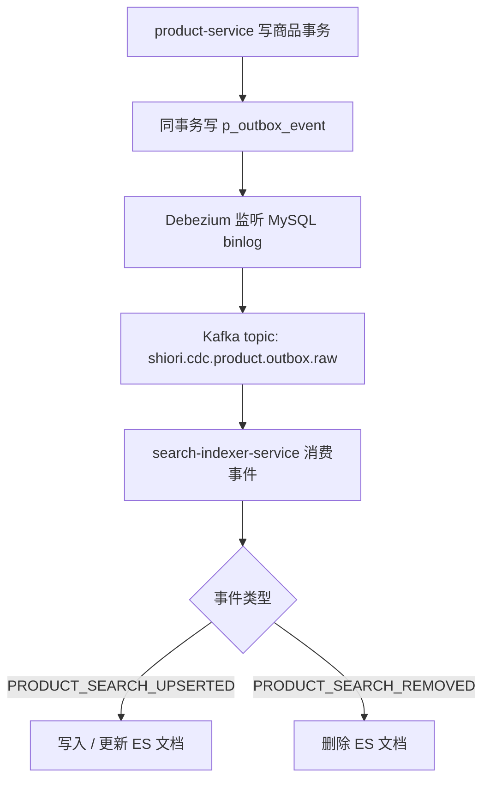

# 商品搜索 ES + CDC 改造原理讲解

## 1. 背景：为什么商品搜索不能继续只靠 MySQL

商品列表接口原来更适合做结构化筛选，不适合承担“全文搜索 + 分词 + 相关性排序”。

如果继续只靠 MySQL，问题会集中在 4 个方面：

1. `LIKE '%关键词%'` 很难做好中文分词。
2. 相关性排序能力弱，通常只能按时间或价格排，搜出来“不像搜索结果”。
3. 搜索和交易主库争抢资源，热点关键词会把读压力直接压到 MySQL。
4. 一旦后面要继续扩展联想词、权重、召回策略，MySQL 路径会越来越难讲清楚。

所以这次改造的目标不是“把 Elasticsearch 接上”，而是把商品搜索补成一条可以自洽回答这些问题的链路：

1. 为什么搜索索引不直接双写。
2. 为什么搜索库和交易库要解耦。
3. 搜索索引和业务真相源怎么保持一致。
4. Elasticsearch 异常时为什么还能兜底。
5. 全量重建、增量更新、回退查询分别怎么做。

---

## 2. 先把架构边界讲清楚

这次搜索链路有一个核心原则：

> `product-service` 是商品真相源，Elasticsearch 只是搜索投影，不是真相源。

所以我没有让业务写路径直接双写 MySQL 和 ES，而是拆成 3 层：

1. `product-service` 负责写业务库，并把“索引该怎么变”写成 outbox 事件。
2. Debezium 监听 `p_outbox_event`，把事件变更送到 Kafka。
3. `search-indexer-service` 消费 Kafka，把事件投影到 Elasticsearch。

查询层也做了边界控制：

1. 有 `keyword` 时优先查 ES。
2. ES 不可用时按配置回退 MySQL。
3. 无 `keyword` 的常规列表仍走原有数据库分页路径。

这条边界非常重要，因为它决定了面试里你能不能把“搜索系统”和“交易系统”分开讲。

---

## 3. 方案总览：这次到底补了什么

这次补了 6 件事：

1. 商品变更写出搜索 outbox 事件。
2. 通过 Debezium + Kafka 把 outbox 变成增量索引流。
3. 新增独立 `search-indexer-service` 构建 ES 文档。
4. 给商品搜索接口接入 ES 查询、分词和相关性排序。
5. 做 ES 异常时的 MySQL fallback。
6. 做内部 `reindex` 能力，支持全量重建索引。

可以把这套方案概括成一句话：

> 业务写入只碰真相源和 outbox，搜索索引通过 CDC 异步构建；查询优先走 ES，异常时允许降级回 MySQL。

---

## 4. 关键术语

### 4.1 真相源

真相源就是最终以谁的数据为准。

这次真相源是 `product-service` 的 MySQL，而不是 Elasticsearch。因为 ES 只是为了搜索性能和检索能力建立的投影，它允许短暂滞后，但不能反过来决定商品真实状态。

### 4.2 投影

投影可以理解成：

> 把业务主数据按另一个查询场景重组出来的副本。

这次 ES 文档就是商品搜索投影。它保留的是搜索所需字段，不承担库存扣减、状态流转这些交易职责。

### 4.3 Outbox

Outbox 模式的核心不是“发消息”，而是：

> 把业务状态变化和要发送的事件，放进同一个本地事务里。

这样商品发布成功时，对应的搜索更新事件一定会落库，不会出现“数据库写成功但消息没发出去”的双写不一致。

### 4.4 CDC

CDC 是 `Change Data Capture`，这里指的是：

1. Debezium 监听 MySQL binlog
2. 发现 outbox 表有新增或更新
3. 把这些变更投递到 Kafka

所以这次不是应用主动推 Kafka，而是数据库变更被 CDC 抓走。

### 4.5 分词

中文搜索里，分词决定了“用户输入”和“文档内容”怎么被拆成可匹配的 term。

这次 ES 容器安装了 IK 插件，目的就是让中文标题和描述的检索结果更像搜索，而不是原始字符串匹配。

### 4.6 相关性排序

相关性排序回答的是：

> 多条文档都匹配关键词时，谁更应该排前面。

这次默认是 `_score desc, createdAt desc, productId desc`，也就是说：

1. 先按 ES 相关性分数排
2. 分数相同时再看创建时间
3. 再用 `productId` 做稳定排序

如果用户显式要求价格或时间排序，就让业务排序优先，`_score` 做次级排序。

### 4.7 最终一致性

这条链路不是强一致，而是最终一致。

原因很简单：

1. MySQL 写入先完成
2. outbox 再被 CDC 抓走
3. Kafka 消费后才写 ES

所以商品发布成功后，搜索索引允许有一个短暂传播延迟。

---

## 5. 写路径原理：搜索索引是怎么增量构建的

这里最关键的是：

1. 商品写库和 outbox 落库是一个本地事务。
2. ES 完全不参与业务写事务。
3. 搜索索引的构建由异步链路完成。

这样做的直接好处是：

1. 写路径不会被 ES 可用性绑死。
2. 搜索链路可以单独扩容和重建。
3. 面试官问“双写一致性”时，你可以明确回答用了 outbox，而不是业务代码双写。

---

## 6. 事件模型：为什么不是直接把整行商品表同步到 ES

这次不是让 Debezium 直接同步商品主表，而是同步 outbox 事件。

这样做有 3 个原因：

1. 商品主表字段多，直接同步会把搜索系统和交易模型耦死。
2. 搜索索引需要的是经过业务裁剪后的快照，不是原始表结构镜像。
3. 业务上有“应该上架”“应该下架”“应该重建”这些语义，事件比表镜像更清楚。

这次事件主要有两类：

1. `PRODUCT_SEARCH_UPSERTED`
2. `PRODUCT_SEARCH_REMOVED`

`PRODUCT_SEARCH_UPSERTED` 里带的是搜索快照，包含：

1. `productId`
2. `title`
3. `description`
4. 分类、成色、交易方式、校区等过滤字段
5. `minPriceCent` / `maxPriceCent`
6. `totalStock`
7. `status`
8. `version`
9. `createdAt` / `occurredAt`

这类设计的本质是：

> 搜索索引消费的是“面向搜索的领域事件”，不是数据库内部表结构。

---

## 7. 查询路径原理：商品接口怎么接入 ES

查询侧入口是商品列表接口。

判断逻辑是：

1. 没有 `keyword`，继续走原 MySQL 路径。
2. 有 `keyword` 且 `product.search.enabled=true`，优先走 ES。
3. ES 查询失败且 `product.search.mysql-fallback-enabled=true`，回退 MySQL。

这条路径的价值不只是“可用”，而是方便你解释两件事：

1. 为什么 ES 是增强搜索能力，而不是替代业务库。
2. 为什么线上搜索系统可以灰度接入，而不是一次性强切。

---

## 8. 排序策略：为什么默认要先按 `_score`

搜索场景最怕的不是“查不到”，而是“查得到但不像搜索”。

如果用户输入关键词后，结果仍然只按时间倒序或价格排序，体验会像普通列表页，不像搜索。

所以这次默认排序是：

1. `_score desc`
2. `createdAt desc`
3. `productId desc`

这个组合解决了两个问题：

1. 先保证关键词匹配更强的文档排前面。
2. 在相关性接近时，结果顺序仍然稳定、可解释。

而显式排序场景下，策略变成：

1. 业务排序优先
2. `_score` 次级

也就是：

> 用户显式表达排序意图时，尊重用户；默认搜索时，尊重相关性。

---

## 9. 重建能力：为什么必须做 `reindex`

只做增量同步还不够，搜索系统一定要能全量重建。

因为下面几种情况都会要求你重新构建索引：

1. 新增索引字段
2. 改 mapping 或 analyzer
3. 历史消息丢失或消费者出错
4. 想从业务库重新校正 ES 状态

所以这次额外补了内部 `reindex`：

1. 按批次扫描在售商品
2. 重新生成 `PRODUCT_SEARCH_UPSERTED` outbox
3. 再走一遍 CDC -> Kafka -> Indexer -> ES 链路

这一步的意义不是“为了方便开发”，而是让搜索系统具备真正可运维性。

---

## 10. 为什么不直接业务双写 ES

这是面试里几乎一定会被追问的问题。

我不选业务双写 ES，主要因为它把最难的问题留在了主写路径里。

如果业务代码同时写 MySQL 和 ES，会立刻面对：

1. MySQL 成功、ES 失败怎么办
2. 重试时会不会重复写
3. ES 短暂不可用时要不要把业务发布一起打挂
4. 以后还要不要再接别的下游

而 outbox + CDC 的思路是：

1. 先保证真相源和事件原子落库
2. 再把搜索索引构建放到异步链路

它牺牲的是强一致，换来的是写路径稳定性、扩展性和可恢复性。

---

## 11. 一致性怎么回答

这次搜索链路应该明确回答成：

1. 业务真相源对外是 MySQL
2. 搜索索引对外是最终一致
3. ES 短暂滞后是允许的
4. 通过 fallback 和 reindex 来兜住一致性风险

所以这里不要硬说“强一致”，正确表述应该是：

> 交易数据是强真相源，搜索投影是最终一致；当投影暂时异常时，接口可以按配置降级回数据库。

---

## 12. 失败场景怎么兜底

### 12.1 ES 不可用

ES 不可用时，查询侧可以回退 MySQL。

这样做的代价是：

1. 搜索体验退化
2. 分词和相关性排序能力变差

但接口不会直接不可用。

### 12.2 CDC / Kafka / Indexer 中断

如果链路中断，增量索引会停止推进，但业务写库仍然不受影响。

恢复后有两种补偿方式：

1. 继续消费未处理消息
2. 必要时触发 `reindex`

### 12.3 历史数据和索引不一致

这时不应该手工补单条 ES 文档，而应该优先走全量重建，让索引重新从真相源推导出来。

---

## 13. 这次方案最大的技术价值

如果要把这次项目压缩成一句面试表达，我会这样讲：

> 我把商品搜索从“数据库模糊查询”升级成了“真相源与搜索投影分离”的架构：业务写入通过 outbox 原子落库，Debezium + Kafka 做异步增量索引，独立 indexer 写 Elasticsearch，查询侧优先走 ES 并支持 MySQL fallback，同时提供全量 reindex 保证搜索系统可恢复。

这句话里其实已经包含了 5 个可展开的点：

1. 为什么要引入 ES
2. 为什么不用业务双写
3. 为什么要用 outbox + CDC
4. 为什么要有 fallback
5. 为什么一定要做 reindex

---

## 14. 面试里最值得主动强调的点

如果你想把这次经历讲得更“高级”，建议主动强调下面几点：

1. 你没有把 ES 当真相源，而是明确定位成搜索投影。
2. 你没有用业务双写，而是用 outbox 解决事务边界问题。
3. 你不是只做了增量消费，还补了全量重建能力。
4. 你不是只追求搜索能力，还考虑了 ES 故障时的服务降级。
5. 你把默认相关性排序和显式业务排序区分开了，这说明你理解搜索和列表不是一回事。

这几个点加起来，面试官通常会认为你讲的是一套“可落地、可运维、可恢复”的搜索架构，而不是“我把 ES 接进来了”。
