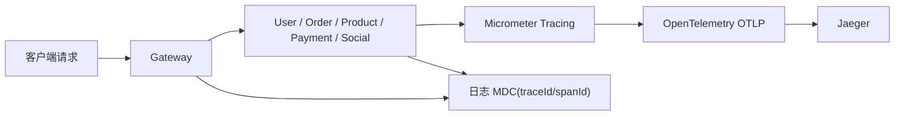

# 分布式链路追踪接入与验证

## 1. 目标

这次改造的目标不是“把 Jaeger 跑起来”，而是给 Shiori 的 Java 微服务主链路补一个可用的分布式追踪闭环：

1. 请求进入网关后自动生成 Trace。
2. `traceparent` 在 Java 服务间自动透传。
3. 每个服务日志都能打印 `traceId/spanId`。
4. 可以在 Jaeger 里看到一次请求经过了哪些服务、每个服务耗时多少。

当前范围只覆盖 6 个 Java 服务：

1. `shiori-gateway-service`
2. `shiori-user-service`
3. `shiori-product-service`
4. `shiori-order-service`
5. `shiori-payment-service`
6. `shiori-social-service`

不包含 Go 的 `shiori-notify-service`。

## 2. 架构



实现上使用的是：

1. `spring-boot-starter-opentelemetry`
2. `Micrometer Tracing`
3. `OpenTelemetry OTLP`
4. `Jaeger all-in-one`
5. `W3C traceparent`

## 3. 关键实现点

### 3.1 统一 tracing 配置

源码 `application.yml` 默认关闭 tracing，避免纯本地单服务调试时持续报 exporter 连接错误：

```yaml
management:
  tracing:
    enabled: ${TRACING_ENABLED:false}
```

Nacos 基础模板默认打开 tracing，便于联调和演示环境直接生效：

```yaml
management:
  tracing:
    enabled: ${TRACING_ENABLED:true}
```

两边统一配置：

1. `defaults.metrics.export.enabled=false`
2. `prometheus.metrics.export.enabled=true`
3. `sampling.probability=1.0`
4. `propagation.consume/produce=[w3c]`
5. `management.opentelemetry.tracing.export.otlp.endpoint`
6. `management.otlp.metrics.export.enabled=false`
7. `management.logging.export.otlp.enabled=false`
8. `logging.pattern.correlation=[service,traceId,spanId]`

### 3.2 修正自定义 HTTP Builder

这次最关键的坑不是“加依赖”，而是原来手写的：

1. `RestClient.builder()`
2. `WebClient.builder()`

会绕过 Spring Boot 已经挂好的 observation / tracing 拦截器，导致即使打开了 tracing，请求头里也没有 `traceparent`。

所以这里改成：

1. `RestClientBuilderConfigurer` 派生 `@LoadBalanced RestClient.Builder`
2. `WebClientCustomizer` 链派生 `@LoadBalanced WebClient.Builder`

这样既保留负载均衡，又能保留 tracing 自动透传。

### 3.3 测试验证

已经补了 3 个定向测试，验证自定义 builder 发请求时会自动带 `traceparent`：

1. `OrderRestClientTracingConfigurationTest`
2. `UserRestClientTracingConfigurationTest`
3. `GatewayHttpClientTracingConfigurationTest`

测试里显式导入了：

1. `ObservationAutoConfiguration`
2. `OpenTelemetrySdkAutoConfiguration`
3. `OpenTelemetryTracingAutoConfiguration`
4. `MicrometerTracingAutoConfiguration`
5. 客户端 observation auto-config

这里 `MicrometerTracingAutoConfiguration` 很关键，因为真正负责 header 传播的是 `PropagatingSenderTracingObservationHandler`。

## 4. 本地启动方式

### 4.1 启动 Jaeger

```bash
cd deploy
docker compose up -d jaeger
```

默认端口：

1. Jaeger UI: `16686`
2. OTLP gRPC: `4317`
3. OTLP HTTP: `4318`

### 4.2 导入带 tracing 的 Nacos 配置

```bash
cd deploy
docker compose up -d nacos nacos-config-init nacos-config-init-local
```

模板会自动注入：

1. `TRACING_ENABLED`
2. `TRACING_SAMPLING_PROBABILITY`
3. `OTEL_EXPORTER_OTLP_ENDPOINT`

Docker 组默认写成 `http://jaeger:4318/v1/traces`，本机 IDE 调试组默认写成 `http://127.0.0.1:4318/v1/traces`。

### 4.3 启动 Java 服务

如果走容器：

```bash
cd deploy
docker compose --profile app up -d \
  shiori-user-service \
  shiori-product-service \
  shiori-order-service \
  shiori-payment-service \
  shiori-social-service \
  shiori-gateway-service
```

如果走 IDE，本机服务只要读取 `SHIORI_DEV_LOCAL` 组配置即可。

## 5. 验证步骤

### 5.1 看 Jaeger UI

打开：

```text
http://127.0.0.1:16686
```

选择服务：

1. `shiori-gateway-service`
2. `shiori-order-service`
3. `shiori-user-service`
4. `shiori-product-service`
5. `shiori-payment-service`
6. `shiori-social-service`

然后执行一次真实请求，例如一次下单、支付、查询订单或依赖用户鉴权的业务调用。

预期结果：

1. 能搜到 Trace。
2. 能看到 gateway 和下游服务的 span 树。
3. 能看到每个 span 的耗时。

### 5.2 用日志反查

服务日志会打印：

```text
[shiori-order-service,<traceId>,<spanId>]
```

排障时的做法是：

1. 先从报错日志里拿到 `traceId`
2. 再去 Jaeger 按时间和服务搜索
3. 对照每一跳 span 的耗时和状态

### 5.3 先跑自动化回归

```bash
cd shiori-java
./gradlew :shiori-order-service:test --tests 'moe.hhm.shiori.order.config.OrderRestClientTracingConfigurationTest'
./gradlew :shiori-user-service:test --tests 'moe.hhm.shiori.user.config.UserRestClientTracingConfigurationTest'
./gradlew :shiori-gateway-service:test --tests 'moe.hhm.shiori.gateway.config.GatewayHttpClientTracingConfigurationTest'
```

## 6. 常见问题

### 6.1 Jaeger 里没有 Trace

优先检查：

1. `TRACING_ENABLED` 是否打开
2. `OTEL_EXPORTER_OTLP_ENDPOINT` 是否指向可达的 Jaeger OTLP HTTP 地址
3. 调用链是否走了统一的 `@LoadBalanced` Builder，而不是新的裸 `RestClient.builder()` / `WebClient.builder()`

### 6.2 日志里有 traceId，但 Jaeger 看不到

通常说明：

1. 本地 span 已经生成
2. 但 exporter 地址不通，或者 Jaeger 没启动

### 6.3 某一跳没有继续透传

优先排查这一跳是否：

1. 使用了框架管理的 HTTP client
2. 被手写 builder 或手写客户端工厂绕开了自动配置

## 7. 当前边界

这次不要过度表述，当前能确认的是：

1. Java HTTP 主链路已经接入 tracing。
2. W3C `traceparent` 已验证可自动透传。
3. 日志可以按 `traceId/spanId` 关联。
4. Jaeger 本地运行链路已补齐。

当前没有承诺的是：

1. Go `shiori-notify-service` 已接入 tracing。
2. Kafka 异步消息链路已经完成跨服务 span 传播验证。
3. 所有第三方客户端都已经补齐 tracing。
